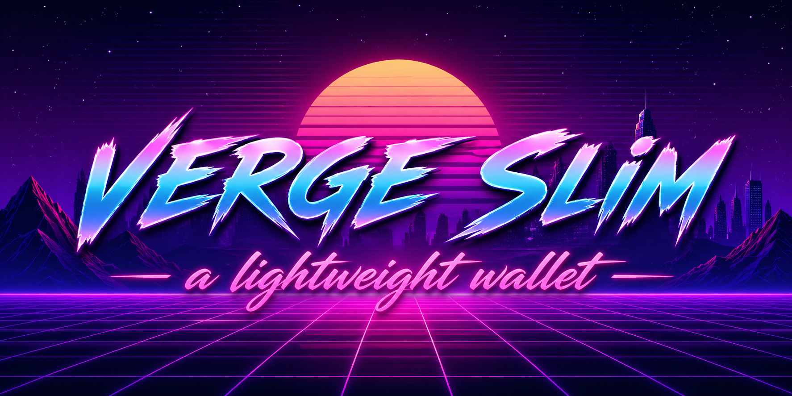

<p align="center">
  
</p>

<p align="center">
  <a href="https://github.com/vergecurrency/VergeSlim/actions" target="_blank"></a>
  
  
  
  
  
  
</p>

### based on MyVergies, originally created by: Swen Van Zanten

Verge Slim is an easy-to-use, secure, light-weight wallet for your Windows/Linux/macOS computer. With **Tor** integrated you can be sure your wallet communication is private! 💪

## Features:

* Sending and receiving XVG
* Store addresses in an address book
* Tor integrated
* Price statistics in different fiat currencies
* Private keys are yours
* Possibility to choose your own wallet service
* Uses No-KYC Stealth Ex over Tor

## Local Development

If you want to help with development, use this setup:

1. Fork the project, and clone it to your local machine.

2. Use Node 22+ and npm 10 (recommended).
```bash
node -v
npm -v
```

3. Install Linux dependencies (Linux only):

Ubuntu/Debian:
```bash
sudo apt update
sudo apt install -y pkg-config libsecret-1-dev
```

Red Hat:
```bash
sudo yum install libsecret-devel
```

Arch Linux:
```bash
sudo pacman -S libsecret
```

4. Install npm dependencies:
```bash
npm ci
```

5. Run a local instance with hot reload:
```bash
npm run electron:serve
```

6. Run tests locally:
```bash
npm test
```

## Packaging / Build

Use these scripts from the project root:

```bash
# Linux AppImage
npm run electron:build:linux

# Windows portable .exe from Linux
npm run electron:build:win
```

Artifacts are written to `dist_electron/`.

### Linux Runtime Note

Some Linux environments require launching the wallet with `--no-sandbox`.

Example:

```bash
./Verge\ Slim-1.1.0.AppImage --no-sandbox
```

Please setup your own local VWS instance to test your changes against. You can checkout [the bitcore repository](https://github.com/vergecurrency/bitcore) and setup an instance [using docker](https://github.com/vergecurrency/bitcore/blob/main/Docker.md).

## Tor Notes

This repository includes platform Tor binaries under `public/bin/Tor`.

Please do not replace Tor with a system binary for normal development. The app is configured to use the repository-provided Tor assets in packaged builds and during runtime install.

### Docs Website

Build the static docs site:

```bash
npm run docs:build
```

## Build With

* [Vue.js](https://github.com/vuejs/vue) - Vue.js is a progressive, incrementally-adoptable JavaScript framework for building UI on the web
* [Electron](https://github.com/github/electron) - Build cross-platform desktop apps with JavaScript, HTML, and CSS
* [Vue CLI](https://github.com/vuejs/vue-cli) - The renderer build uses Vue CLI with webpack 5
* [Electron Builder](https://github.com/electron-userland/electron-builder) - Packaging is handled directly without the old Vue Electron plugin layer
* [Tor](https://dist.torproject.org/torbrowser/) - The intergration of Tor (expert bundle binary) makes sure your transactions are private

### Community

* [Telegram](https://t.me/officialxvg)
* [Discord](https://discord.gg/vergecurrency)
* [Twitter](https://x.com/vergecurrency)
* [Facebook](https://www.facebook.com/VERGEcurrency/)
* [Reddit](https://www.reddit.com/r/vergecurrency/)

## Contributing

Please read [CONTRIBUTING.md](CONTRIBUTING.md) for details on our code of conduct, and the process for submitting pull requests to us.

